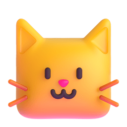

<b>Kitten Framework</b>

### A powerful `Node.js` framework to simplify creating WhatsApp bots, built on top of the [Baileys](https://github.com/WhiskeySockets/Baileys) library. 😺

---

 

**Made with ❤️ for whatsapp community**

